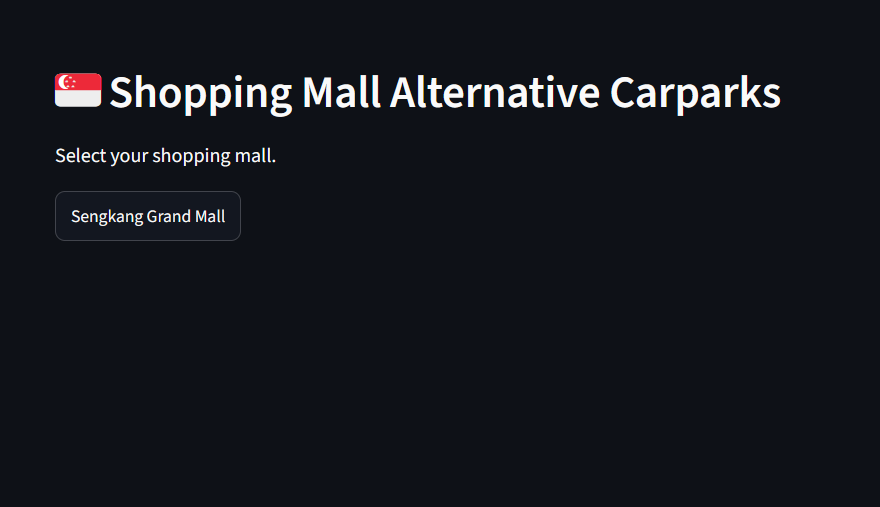
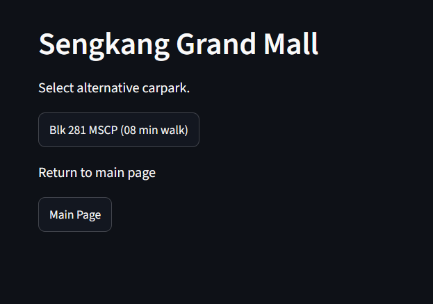
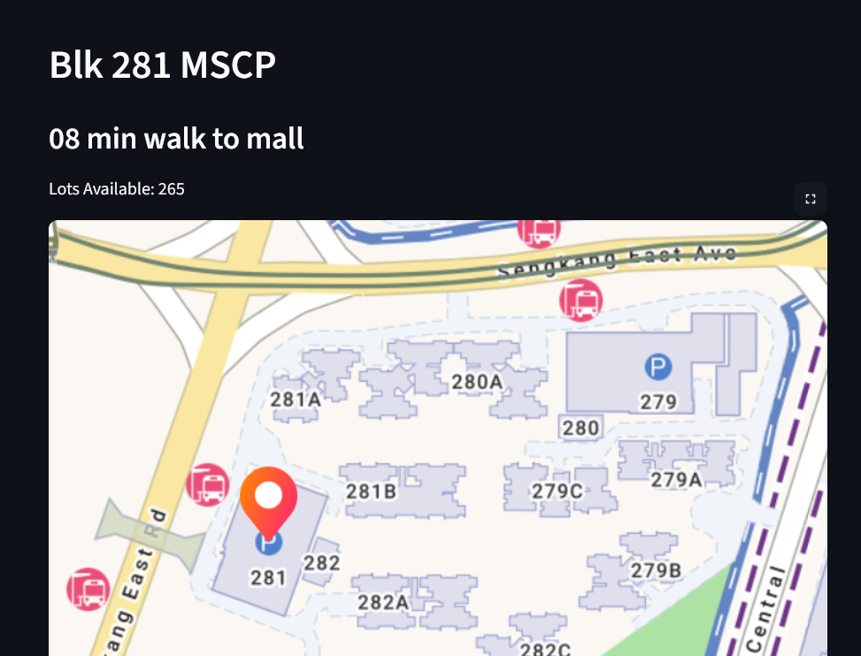
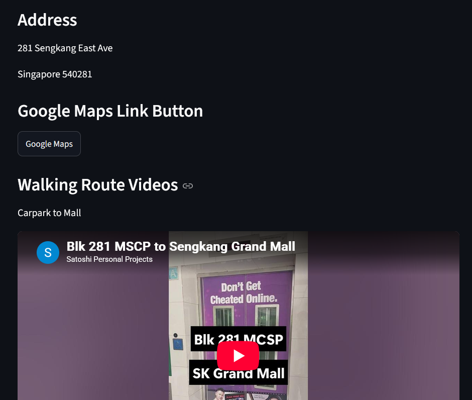
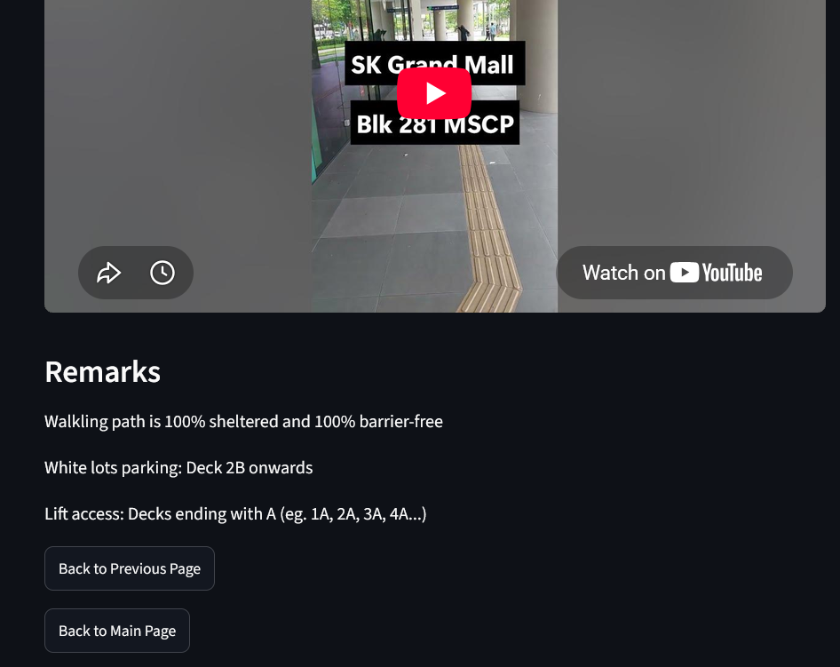

# Mall Alternative Parking Locator

This Streamlit web app helps users find alternative carparks near popular shopping malls. It is specifically designed for young families who want to avoid the stress and long queues often found at mall carparks. The app filters for alternative parking options that are within an 8-minute walking distance, fully sheltered, and 100% barrier-free.




## Features

Users can select their desired mall and choose a specific alternative carpark to view comprehensive details, including:
* **Walking Time:** Estimated time to walk between the carpark and the mall.
* **Real-Time Availability:** Live counter of available parking lots, pulled directly from the HDB API.
* **Navigation:** The carpark's address and a clickable Google Maps link to easily set driving directions.
* **Video Guides:** Embedded YouTube videos showing the exact walking routes from the carpark to the mall (and vice versa) to showcase the sheltered, barrier-free paths.
* **Additional Details:** Information on which decks have white lot parking and the exact locations of lift lobbies.





## Current Status & Roadmap

Currently, the web app only supports **Sengkang Grand Mall (SGM)**. 

Future updates (time permitting) will include:
* Bedok Mall (BM)
* Junction 8 (J8)

## How to Run on Windows

**Prerequisite:** Ensure you have Python installed on your Windows machine (downloadable from [python.org](https://www.python.org/)).

### First-Time Setup
1. Download this project as a ZIP file, unzip it, and place it in your preferred location.
2. Open **Command Prompt**.
3. Navigate to the project folder by running: 
   ```cmd
   cd path\to\project\folder
   ```
4. Create a virtual environment:
   ```cmd
   py -m venv venv
   ```
5. Activate the virtual environment:
   ```cmd
   venv\Scripts\activate
   ```
6. Install Streamlit:
   ```cmd
   pip install streamlit
   ```
7. Run the web app:
   ```cmd
   streamlit run Home.py
   ```
8. A web browser will automatically open the web app. Feel free to navigate and explore!

### Subsequent Runs
For future uses, you only need to run the following steps in your Command Prompt:
1. `cd path\to\project\folder`
2. `venv\Scripts\activate`
3. `streamlit run Home.py`

> **Important Note:** If you ever move the project folder to a different location on your computer, the virtual environment paths will break. You will need to delete the `venv` folder and repeat the **First-Time Setup** steps from scratch.

## Project Structure

```text
.
├── Home.py                          # Main entry point and homepage of the web app
├── pages/                           # Subpages for specific malls and carparks
│   ├── 101_Sengkang Grand Mall.py   # Page detailing SGM's alternative carparks
│   └── 201_Blk 281 MSCP.py          # Specific details for Blk 281 MSCP
├── library.py                       # Backend helper functions (e.g., pinging the HDB API)
├── .streamlit/
│   └── config.toml                  # Streamlit configuration (used to disable the default sidebar)
├── assets/                          # Media and preview images
│   ├── screenshot.png               # Screenshot of a map used in the web app
│   ├── main_page.png                # Preview screenshot for the README
│   ├── sgm_page.png                 # Preview screenshot for the README
│   ├── 281_1.png                    # Preview screenshot for the README
│   ├── 281_2.png                    # Preview screenshot for the README
│   └── 281_3.png                    # Preview screenshot for the README
└── README.md                        # Documentation and setup instructions
```

### Naming Convention for `pages/`
The files in the `pages` directory follow a specific numbering system to keep the sidebar organized:
* **1XX:** All possible malls (`101` for SGM, `102` for BM, `103` for J8)
* **2XX:** SGM's alternative carpark(s)
* **3XX:** BM's alternative carpark(s)
* **4XX:** J8's alternative carpark(s)